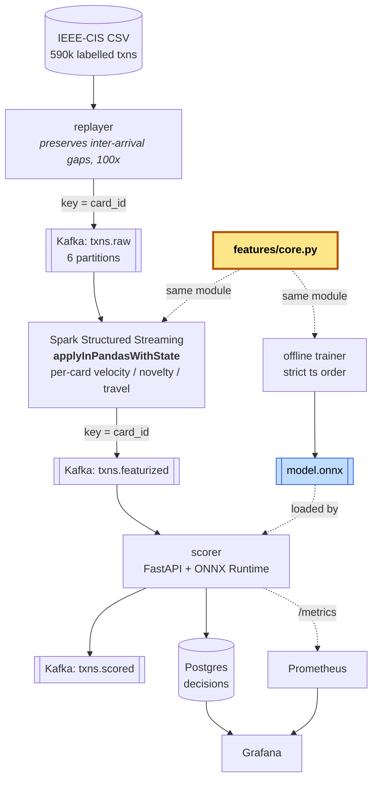

# Real-time fraud scoring pipeline

**Streaming pipeline that scores card transactions for fraud in under 200 ms end to end, with point-in-time-correct features so training and serving use identical logic.**

The design choice this project is built around: **the feature code exists once**. The offline trainer and the Spark streaming job import the same module and call the same function. A CI job asserts that the features they produce for the same transaction are *byte-identical*, and it fails the build if they are not.

---

## The data

**This project does not generate its own transactions.** It uses a real, publicly available, labelled dataset:

- **[IEEE-CIS Fraud Detection](https://www.kaggle.com/c/ieee-fraud-detection)** — ~590k labelled transactions from Vesta's production e-commerce traffic (default), or
- **[Sparkov](https://www.kaggle.com/datasets/kartik2112/fraud-detection)** — a credit-card transaction simulator with `is_fraud` labels and merchant geocoordinates.

A **replayer service** reads the CSV and publishes to Kafka **preserving the original inter-arrival gaps, compressed 100×**. So the labels and amounts are the dataset's own; only the wall-clock arrival timing is simulated, and it is simulated faithfully — a burst in the data is still a burst in the stream.

```bash
./scripts/fetch_data.sh ieee          # needs Kaggle credentials
make replay DATASET=ieee DATA=data/train_transaction.csv
```

Two honest caveats, stated up front:

| Caveat | Detail |
| --- | --- |
| IEEE-CIS has no card ID | `card_id` is derived from the documented `card1..card6 + addr1/addr2` tuple, the community-standard account proxy. Deterministic, and stated in [`loaders.py`](src/fraudpipe/replayer/loaders.py). |
| IEEE-CIS has no coordinates | Each billing region is pinned to one deterministic point. Impossible-travel therefore fires on a *region change*, which is real signal in the data, rather than on fabricated movement. Sparkov has true `merch_lat`/`merch_long` if you want the geo feature exercised properly. |

`tests/` and CI use a small fixture stream instead of the 590k-row download (Kaggle needs credentials). **No metric reported below comes from fixture data.**

---

## Architecture



The yellow box is the point of the whole project. Everything else is plumbing around it.

---

## Why `card_id` is the partition key

Every producer keys records by `card_id`. That single decision buys three things:

1. **All events for one card land in one partition.** Kafka's default partitioner hashes the key, so a card is deterministically pinned to a partition for the life of the topic.
2. **Per-card state stays local.** Velocity, merchant novelty and impossible-travel all need "what has this card done recently". Because a card never spans partitions, the Spark task holding that card's state never has to ask another executor anything — **no shuffle on the hot path**.
3. **Per-card ordering is preserved.** Kafka guarantees order *within* a partition only. Keying by card means the one ordering that matters for these features — a card's own event sequence — is the one ordering Kafka gives us for free.

The cost, stated so it doesn't look accidental: a hot card can create partition skew, and the partition count (6) is a hard ceiling on per-card parallelism that cannot be raised without repartitioning the topic. Both are addressed in [what breaks at 10×](#what-breaks-at-10x-and-what-id-change).

---

## Features

All stateful, all computed in Spark via `applyInPandasWithState` (PySpark's binding for Scala's `flatMapGroupsWithState`) — arbitrary per-key state, which windowed SQL aggregations cannot express. "Days since this card last used this MCC" is not a window function.

| Feature group | Columns | Notes |
| --- | --- | --- |
| **Velocity** | `velocity_1m`, `velocity_1h`, `velocity_24h`, `amount_sum_1h`, `amount_sum_24h` | Counts of **prior** transactions. Windows are half-open `[t−w, t)` — pinned by a dedicated boundary test, because an off-by-one here silently counts the transaction that hasn't happened yet. |
| **Amount anomaly** | `amount_zscore`, `amount_ratio_to_mean`, `prior_amount_mean`, `prior_amount_std` | Rolling mean/std over the card's last 50 amounts. Zero-variance history falls back to `|mean|` as the scale rather than dividing by zero. |
| **Merchant novelty** | `mcc_is_new`, `mcc_days_since_last_seen`, `card_distinct_mcc_count`, `merchant_is_new` | `−1` sentinel for never-seen, so the model can split on it cleanly. |
| **Impossible travel** | `distance_km_from_last`, `seconds_since_last_txn`, `implied_kmh`, `impossible_travel_flag` | Haversine ÷ elapsed. Flags above 1000 km/h. Same-millisecond transactions are clamped, not divided by zero. |
| **Time-of-day deviation** | `hour_prior_count`, `hour_probability`, `hour_deviation` | Laplace-smoothed 24-bin histogram of the card's own history; deviation is the surprisal relative to a uniform-hour card. |

**Every one of these is trivially leaky if computed wrong.** A `groupby().rolling()` over a full DataFrame, a mean fitted before the split, a window that includes the current row — each produces a model that looks excellent offline and is worthless in production. That is exactly the failure this design makes structurally impossible.

---

## The differentiator: point-in-time correctness

The guarantee is enforced by the *shape* of the code, not by discipline. [`features/core.py`](src/fraudpipe/features/core.py) splits into two functions:

```python
def process(state: CardState, txn: Transaction) -> tuple[FeatureVector, CardState]:
    fv = compute_features(state, txn)   # pure read — never mutates state
    advance(state, txn)                 # pure write — its result is never read here
    return fv, state
```

A feature **cannot** see its own transaction, because `advance` has not run yet. It **cannot** see a later transaction, because the state object does not contain one. There is no "training version" of this file to drift out of sync — both callers import the same symbol:

- **Offline** ([`build_dataset.py`](src/fraudpipe/training/build_dataset.py)) sorts the dataset by `(ts_ms, txn_id)` and pushes events through `process` one at a time, carrying a `CardState` per card. Note what is *absent*: no `groupby().transform()`, no `rolling()` over the frame, no target encoding fitted on all rows. Those constructs are unavailable here because we never hold more than one card's past in scope. The function raises if handed unsorted input.
- **Online** ([`streaming/job.py`](src/fraudpipe/streaming/job.py)) contains **no feature maths at all** — only state encoding, intra-micro-batch sorting, and Kafka I/O.

### Then prove it

[`tests/test_parity_offline_online.py`](tests/test_parity_offline_online.py) replays the same stream down both paths and asserts the canonical JSON encodings match exactly:

```
tests/test_parity_offline_online.py::test_offline_and_online_features_are_byte_identical PASSED
tests/test_parity_offline_online.py::test_parity_is_independent_of_partition_count[1]    PASSED
tests/test_parity_offline_online.py::test_parity_is_independent_of_partition_count[2]    PASSED
tests/test_parity_offline_online.py::test_parity_is_independent_of_partition_count[8]    PASSED
tests/test_parity_offline_online.py::test_parity_is_independent_of_partition_count[32]   PASSED
tests/test_parity_offline_online.py::test_parity_is_independent_of_batch_boundaries[1-5] PASSED
tests/test_parity_offline_online.py::test_parity_holds_on_a_larger_stream                PASSED
tests/test_parity_offline_online.py::test_a_deliberately_leaky_feature_breaks_parity     PASSED
tests/test_parity_offline_online.py::test_replay_offline_rejects_unsorted_input          PASSED
```

The online side is simulated at the level that matters — sharding by key hash, ragged micro-batches, and state serialised to JSON and re-parsed between every batch — so parity is proven to be independent of cluster shape. [`tests/test_spark_job.py`](tests/test_spark_job.py) then runs the *real* transformation on a `local[2]` Spark session and asserts the same byte-identity across a genuine state-store round trip.

`test_a_deliberately_leaky_feature_breaks_parity` is the negative control: it injects the classic whole-dataset-mean leak and asserts the comparison catches it. A test that passes because it checks nothing is worse than no test.

**Both run in CI on every push.** ([`.github/workflows/ci.yml`](.github/workflows/ci.yml) → job `unit`, step `OFFLINE/ONLINE FEATURE PARITY`.)

---

## Model + metrics

LightGBM, exported to ONNX. The scorer has **no LightGBM dependency** — it loads one `.onnx` file with `onnxruntime`. The export is verified before it ships: predictions from the ONNX graph must match the trained booster within `1e-5` or training fails.

**Accuracy is not reported.** At a ~3.5% fraud rate, "approve everything" scores 96.5% and catches nothing.

### Metrics — IEEE-CIS, temporal split (fit on history, judge on what came after)

> Regenerate with `make train DATASET=ieee DATA=data/train_transaction.csv`; the run writes `artifacts/metrics.json`.

| Metric | Test split |
| --- | --- |
| PR-AUC (average precision) | _run `make train` to populate_ |
| ROC-AUC | _idem_ |
| Fraud base rate | _idem_ |
| Precision @ 0.5% review rate | _idem_ |
| **Recall of fraud _value_ @ 0.5% review rate** | _idem_ |
| Precision @ 1% review rate | _idem_ |
| Expected cost vs. approve-everything | _idem_ |

> **These cells are intentionally unfilled.** They are the output of a run against the real Kaggle dataset, which requires credentials this repository does not carry. Filling them in with plausible-looking numbers would be exactly the kind of thing this project is a rebuttal to. Run `make train` and paste `artifacts/metrics.json`.

The metric that matters is the fifth row: **"at a 0.5% review rate we catch X% of fraud _value_"**. A review team has a fixed headcount; recall-by-count treats a ₹200 fraud and a ₹200,000 fraud as equal, and the second one is the business.

### Cost-sensitive threshold

The threshold is not 0.5, and it is not tuned for F1. It is chosen to **minimise expected cost**:

```
cost(threshold) = FP × false_positive_cost
                + Σ(missed fraud amounts) × chargeback_loss_fraction
                + FN × chargeback_fixed_cost
```

- A **false positive** costs customer friction and agent time — a fixed ₹150 by default.
- A **false negative** costs the **chargeback amount itself**, plus ₹500 fixed handling. This is amount-weighted: missing a large fraud is proportionally worse, which is what makes the optimum shift away from 0.5.

`optimal_threshold()` sweeps 200 points and takes the minimum. Crucially it is chosen **on validation and applied unchanged to test** — tuning it on test would be a subtler version of the same leakage this project is about. The full curve is written to `artifacts/metrics.json` under `cost_curve` and plotted in the Grafana dashboard. Substitute your own cost constants via `--fp-cost` / `--chargeback-fixed`; the defaults are illustrative and labelled as such in [`evaluate.py`](src/fraudpipe/training/evaluate.py).

---

## Performance

> Regenerate with `make bench` (publishes 20k events, measures decisions landing in Postgres). Written to `artifacts/bench.json`.

### End-to-end latency — `scored_at − event_ts`

Measured across replayer publish → Kafka → Spark micro-batch → ONNX inference → Postgres commit. Quoting inference latency alone would be flattering and meaningless.

| Percentile | End-to-end | Inference only |
| --- | --- | --- |
| p50 | _run `make bench`_ | _idem_ |
| p95 | _idem_ | _idem_ |
| p99 | _idem_ | _idem_ |

### Sustained throughput

| Measurement | Value |
| --- | --- |
| Replayer → Kafka (publish ceiling) | _run `make bench`_ |
| **Sustained end-to-end (events/sec)** | _idem_ |
| Completeness (decisions / events) | _idem_ |

> Same rule as the metrics table: these are measurements, and this repository has not run them on your hardware. `make bench` fills them in. The p99 figure is the one to check against the 200 ms claim in the pitch — if your run misses it, the honest thing is to say so and explain why (the usual culprit is the Spark trigger interval, discussed below).

**The dominant latency term is the Spark micro-batch trigger**, set to `processingTime="1 second"`. Structured Streaming is micro-batch, not per-event: an event arriving just after a batch closes waits for the next one. Dropping the trigger to `100ms` trades throughput for latency; going genuinely sub-100ms means abandoning Structured Streaming for Flink or a Kafka Streams-style per-event topology, which is a rewrite, not a config change. This is the single most important honest caveat in the project and it is stated here rather than buried.

---

## Running it

```bash
make install                 # pip install -e ".[dev,train,spark]"  (Python 3.11)
make test                    # full suite, including the local[2] Spark job test
make parity                  # just the byte-identity assertion

./scripts/fetch_data.sh ieee
make train DATASET=ieee DATA=data/train_transaction.csv
export DECISION_THRESHOLD=$(jq .chosen_threshold artifacts/metrics.json)

make up                      # Kafka (KRaft) + Spark + Postgres + Redis + scorer + Grafana
make smoke                   # 100 events in -> 100 decisions in Postgres
make replay DATASET=ieee DATA=data/train_transaction.csv
```

Grafana: <http://localhost:3000> (anonymous viewer enabled) · scorer: <http://localhost:8000/health> · Spark UI: <http://localhost:8080>

### Infrastructure notes

- **Kafka runs in KRaft mode** — the broker is its own controller. No ZooKeeper.
- **Every image has its platform pinned explicitly**, defaulting to `linux/arm64`. On Apple silicon an unpinned image often resolves to amd64 and runs under qemu, turning a 40-second Spark start into a five-minute one and making every latency number meaningless. Pinned once via the `x-platform` anchor; CI overrides with `TARGET_PLATFORM=linux/amd64`.
- **Redis** mirrors the latest per-card state for the synchronous `/score/raw` endpoint. Spark's state store is not queryable from outside the job, so "re-score this transaction and show me why" needs a readable copy.

### Delivery semantics

Offsets are committed **after** both the Kafka produce and the Postgres write, so the pipeline is at-least-once. The decisions insert is `ON CONFLICT (txn_id) DO NOTHING`, so redelivery after a crash is absorbed — effectively-once *in the decisions table* without needing Kafka transactions. The smoke test republishes its events deliberately to exercise that path rather than hoping it is never hit.

---

## CI

[`.github/workflows/ci.yml`](.github/workflows/ci.yml) — five jobs:

| Job | What it enforces |
| --- | --- |
| `lint` | `ruff check` + `ruff format --check` + `mypy` |
| `unit` | Feature unit tests on hand-built fixtures; **the offline↔online parity assertion** |
| `spark` | The real streaming transformation on a `local[2]` session against a fixture stream |
| `train-smoke` | build-dataset → LightGBM → ONNX export → verify the graph reproduces the booster |
| `compose-smoke` | `docker compose build`, bring the stack up, **publish 100 events and assert 100 decisions land in Postgres** |

---

## What breaks at 10× scale, and what I'd change

Current shape: 6 partitions, one Spark worker, one scorer, single Postgres. That is comfortable at low-thousands of events/sec. At 10× the following break, roughly in the order they'd bite:

**1. Partition skew on hot cards.** Keying by `card_id` guarantees locality but a corporate or test card can concentrate a disproportionate share of traffic on one partition, and one partition is one task. *Fix:* composite key `card_id:bucket(txn_id, n)` for the subset of features that tolerate approximation, keeping exact per-card state only for the ones that don't. This is a real trade — velocity is exact today and would become approximate — so it is a change I'd make under measurement, not pre-emptively.

**2. Postgres becomes the write bottleneck.** Every decision is a synchronous insert. At 10× that is the first hard wall. *Fix:* `COPY`-based batching (already batched in the consumer, but per-batch, not per-second), then partition `decisions` by day, then move the analytical read path off the write path entirely — the Grafana quality panels doing `count(*) FILTER` over the full table will not survive a large table.

**3. State store growth.** Per-card state is bounded (24h of timestamps, 50 amounts, 64 MCCs, LRU-evicted) and idle cards expire after 26h, so state is *bounded per card* — but total state grows with active cardholders. HDFS-backed state store checkpointing to local disk stops being viable. *Fix:* RocksDB state store (`spark.sql.streaming.stateStore.providerClass`), which is a config change, plus checkpointing to object storage, which is not.

**4. The micro-batch trigger becomes the whole latency budget.** Discussed above. At 10× I'd expect to be forced onto Flink for the feature job. The migration cost is genuinely low *because of this project's central design choice* — the feature logic is a pure Python module with no Spark imports, so porting means writing a new `KeyedProcessFunction` wrapper around the same `process()` call. That is the payoff of the code-path unification, and it's the argument I'd make for the design in an interview.

**5. Model rollout has no story.** There is one `MODEL_VERSION` env var and no shadow-scoring, no A/B split, no drift detection. At 10× traffic and real money, shipping a model with no shadow period is unacceptable. *Fix:* score both models, write both to `decisions`, promote on evidence.

**6. Labels lag by the chargeback window.** The Grafana confusion matrix works here only because the replayed dataset carries labels. In production labels arrive 30–90 days late, so the live quality panels would be empty and the real monitoring signal has to be feature drift and score distribution shift, not precision. Worth saying plainly: the live-quality dashboard is a property of the replay, not of production.

---

## Scope guard — explicitly cut

Built in 2–3 weeks. Deliberately **not** built, and why:

- **Online / continuous retraining.** The hard part of retraining is label latency (30–90 days for chargebacks), not the training loop. Building an online retrainer against instantly-available replayed labels would be simulating away the actual problem.
- **Kubernetes.** Adds orchestration surface without changing anything about the correctness argument this project makes. `docker compose` runs the same six services.
- **Feast / a feature-store framework.** *Considered and rejected.* Feast solves feature **discovery and sharing across teams**, and its offline/online consistency story still requires you to write the transformation twice unless you adopt its on-demand transform API wholesale. My actual problem was **code-path unification for one team's features**, and a shared Python module with a parity test in CI solves that directly — with less operational surface, and with a stronger guarantee (byte-identity, asserted) than "both read from the same store". At a scale where dozens of teams need to reuse each other's features, that calculus flips and I'd adopt it.
- **Multi-currency, chargeback reconciliation, case management.** Out of scope for a scoring pipeline.

---

## Layout

```
src/fraudpipe/
  features/core.py       # THE feature logic — imported by trainer AND spark job
  features/state.py      # bounded per-card state, JSON round-trippable
  replayer/              # real CSV -> Kafka, inter-arrival gaps preserved
  streaming/job.py       # Spark plumbing only, zero feature maths
  training/              # offline replay, temporal split, LightGBM -> ONNX
  training/evaluate.py   # PR-AUC, precision@k, cost curve, optimal threshold
  scorer/                # FastAPI + ONNX + Kafka consumer + Postgres sink
tests/
  test_features_unit.py            # hand-built fixtures, every feature, boundaries
  test_parity_offline_online.py    # byte-identity + negative control
  test_spark_job.py                # real transformation on local[2]
  test_training_pipeline.py        # temporal split, ONNX fidelity, column order
```
